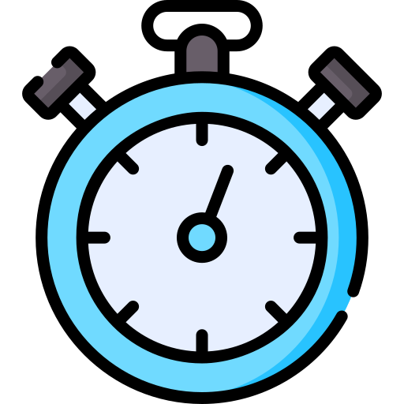
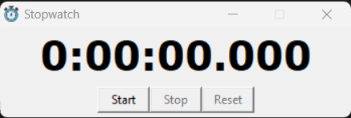

# Stopwatch

> A simple stopwatch application built using Python and Tkinter.


[](https://opensource.org/licenses/MIT)


<p align="center">
  
</p>

## About The Project

This is a simple stopwatch application built using Python and Tkinter. It allows users to start, stop, and reset the stopwatch. The application also supports keyboard shortcuts for quick access.

### Key features

- Start, stop, and reset buttons
- Keyboard shortcuts: Space to toggle start/stop, 'R' to reset

### Built With

- [Python](https://www.python.org/)
- [Tkinter](https://docs.python.org/3/library/tkinter.html)

## Getting Started

To get a local copy up and running follow these simple example steps.

### Prerequisites

Before you begin, ensure you have met the following requirements:

- Check python version:

  ```sh
  python --version 
  # Python 3.10.9
  ```

### Installation and run application

There are two options:

1. Clone the repository to your local machine:

    ```sh
    git clone https://github.com/KarthikUdyawar/Stopwatch.git
    ```

2. Navigate to the project directory:

    ```sh
    cd Stopwatch
    ```

3. Run the application:

    ```sh
    python stopwatch.py
    ```

OR

- Download the executable file [Download link](https://github.com/KarthikUdyawar/Stopwatch/releases/tag/1.0.0)

## Usage

<p align="center">
  
</p>

1. The application window will open, displaying the stopwatch with start, stop, and reset buttons.

2. To start the stopwatch, click the "Start" button or press the spacebar on your keyboard.

3. To stop the stopwatch, click the "Stop" button or press the spacebar again.

4. To reset the stopwatch, click the "Reset" button or press the 'R' key on your keyboard.

5. You can also use the keyboard shortcuts: press the spacebar to toggle start/stop and press 'R' to reset the stopwatch.

6. Explore the application and enjoy using your Python stopwatch!

## Roadmap

See the [open issues](https://github.com/KarthikUdyawar/Stopwatch/issues) for a list of proposed features (and known issues).

## Contributing

Contributions are what make the open source community such an amazing place to be learn, inspire, and create. Any contributions you make are **greatly appreciated**.

1. Fork the Project
2. Create your Feature Branch (`git checkout -b feature/AmazingFeature`)
3. Commit your Changes (`git commit -m 'Add some AmazingFeature'`)
4. Push to the Branch (`git push origin feature/AmazingFeature`)
5. Open a Pull Request

## License

Distributed under the MIT License. See `LICENSE` for more information.

## Contact

[Karthik Udyawar](https://www.datascienceportfol.io/karthik_udyawar) - <karthikajitudy@gmail.com>
